# INSTAL·LACIÓ OWNCLOUD

**INSTAL.LAR APACHE** 

1.instal.larem el servidor apache:

2. Desactivem el llistat de directoris del servidor:

**INSTAL.LAR MariaDB**

1.instal.larem MariaDB:

2.i aqui el que farem sirà configurar la instal.lació

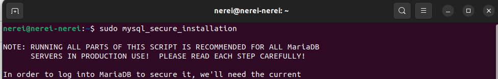

3. Aqui el que farem sirà:
Deshabilitar els usuaris anònims, deshabilitar el acces remot com a root, Eliminar les bases de dades de testeig i accedir-hi i Actualitzar les taules de privilegis.

4. Ara per ultim reiniciarem el servidor MariaDB

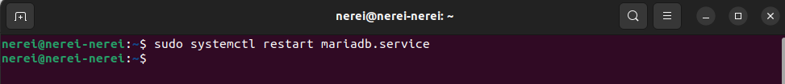

**CREAR LA BASE DE DADES D'OWNCLOUD**

1.El que farem ara sirà entrar a MariaDB amb aquesta comanda i crearem la base de dades:

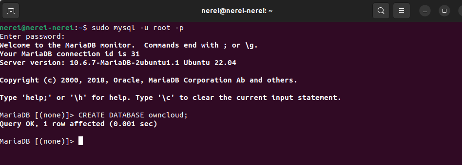

2. Ara el que farem sirà crear un usuari que es digui ownclouduser amb una contrassenya que sirà Admin1234 i li donarem acces a la base de dades que hem creat i després sortirem:

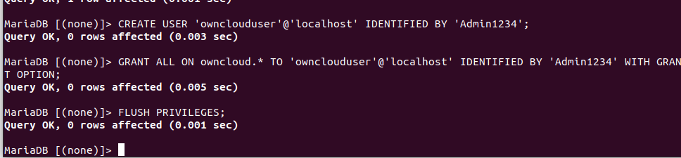

**INSTAL.LAR PHP I ELS SEUS MÒDULS NECESSARIS**

1. El que farem sirà escriure aquestes comandes:

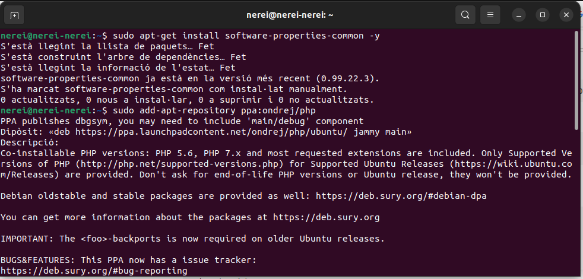

2.Ara actualitzarem els paquets:

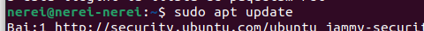

3.Ara instal.larem PHP i els seus mòduls:

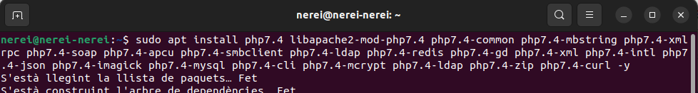

4.Ara amb aquesta comanda editarem el fitxer i li canviarem a aquests valors:

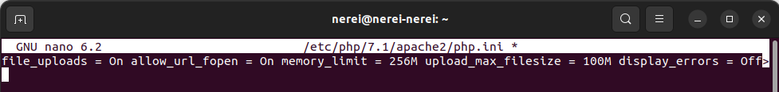

**INSTAL·LAREM OWNCLOUD:

1.Descarregarem la ultima versió del programa:

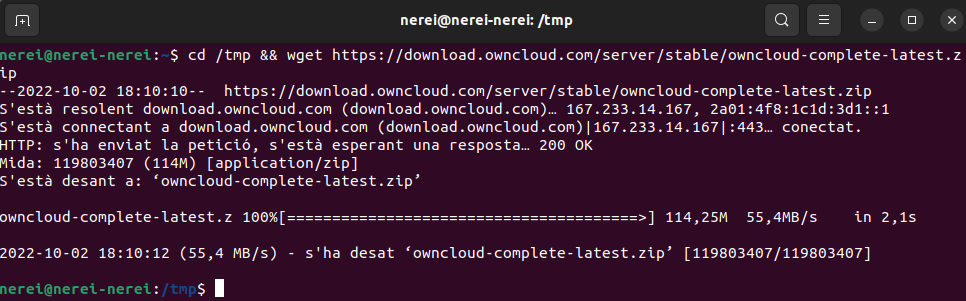

2. Ara ho descomprimirem amb aquesta comanda:

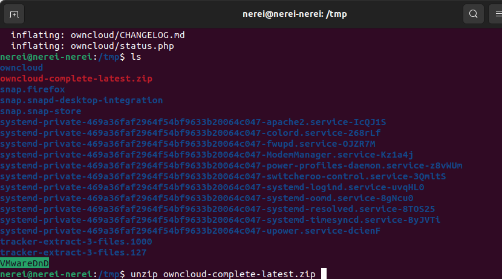

3.Ara menejarem els arxius de Owncloud a /var/www/html/owncloud

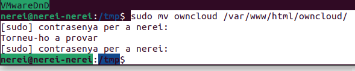

4.Ara canviarem propietaris i permisos de els directoris de owncloud per a que es pugi llegir i executar:

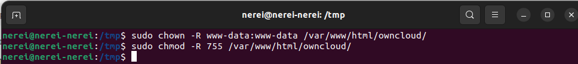
